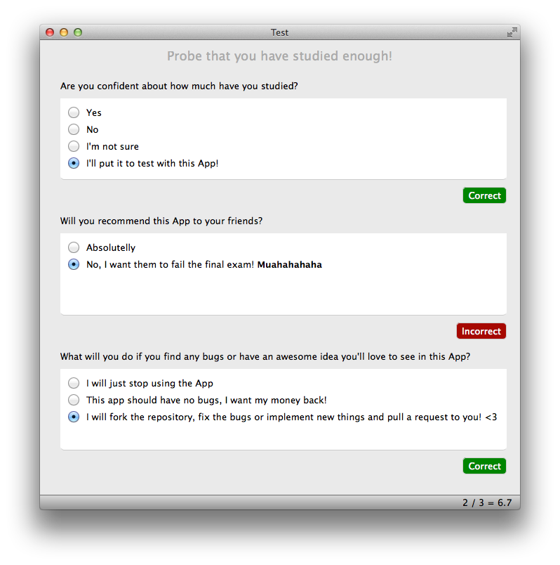

Test
====

A simple App to create and make tests, really helpful to study.




## Building Test

You only need Qt 5 framework to build Test in your platform (Windows, Mac or Linux). Download [Qt 5](http://qt-project.org/downloads), install it and open `Test.pro` with *Qt Creator*. That's all!

## Download

Right now I don't offer any precompiled binaries so you'll need to build it within *Qt Creator*, but don't worry, in the future there will be download links here for each platform ;-)

## Creating your own tests

*Test* uses JSON files to store test's data, so it's very easy to write your own tests. In the source code you can find a template from which you can start, but every *Test* document will look like this:

````
{
    "questions" :
    [
        {
            "description" : "This is the text of your first question of the test.",
            "options" :
            [
                "First possible solution.",
                "Second possible solution.",
                "Third possible solution (the correct one)."
            ],
            "solution" : 3
        }
    ]
}
```` 

## License

Refer to the `LICENSE` file for further information.